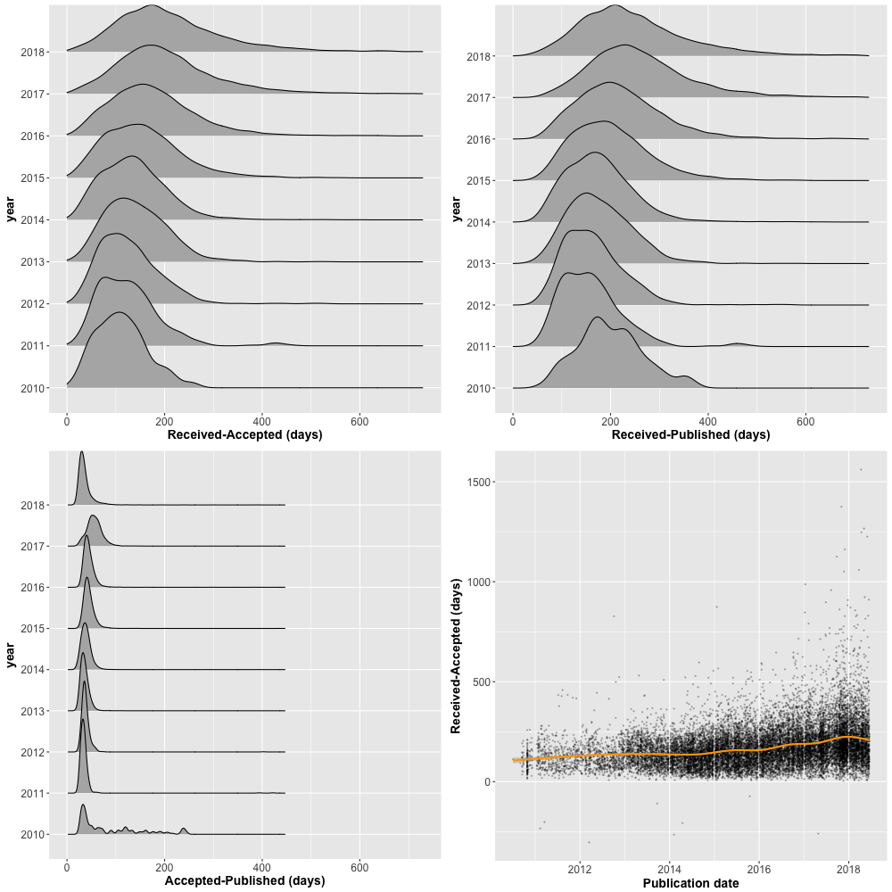

# PubMedLagR
Publication lag time analysis from PubMed data

Get a summary of publication lag times from a PubMed XML file.

1. Run a Pubmed search and download the file as XML. Example query: `nat commun[ta] AND 2000 : 2018[pdat] AND journal article[pt]`. Select _Send To: File: XML_.
2. Run `pubmedlag.R` pointing R at your downloaded XML file.
3. R will save a version of the data as csv, it will calculate publication lag time, make some plots and save as png.

Three dates of interest are stored in a complete pubmed record.

1. When the paper was _received_.
2. When the paper was _accepted_.
3. When the paper was _published_.

Note that **these dates are not available for every record**. This is especially true of older papers.

Because we have three dates, we can calculate three different time periods.

1. From received to accepted (recacc).
2. From received to published (recpub).
3. From accepted to published (accpub).

Most of the time the accpub time is short and constant for a journal, and so the mose interesting time is recacc.

## More info

The original `pubmedXML.R` is by [christopherBelter](https://github.com/christopherBelter/pubmedXML/commit/915ae0d873ef68360f6289dd90055c6f22dcaa18). It has been modified to retrieve the necessary data.

For more on publication lag times:

- Check out Daniel Himmelstein's [History of Delays](https://blog.dhimmel.com/history-of-delays/).
- Posts at [quantixed on lag times](https://quantixed.org/tag/lag-times/).
